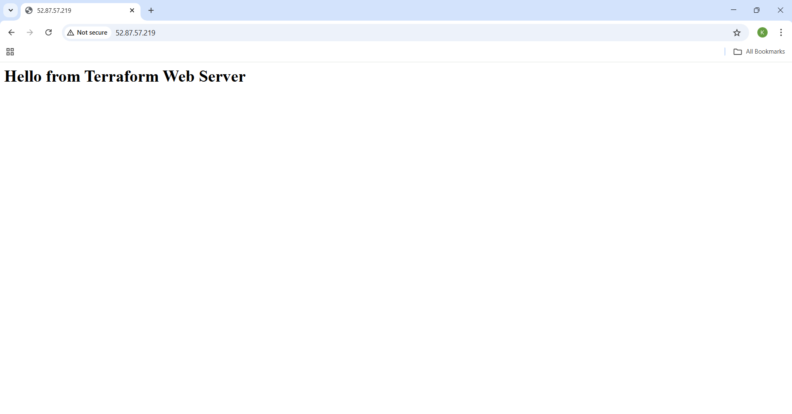

# Automated AWS EC2 & VPC Infrastructure using Terraform

## Overview
This project automates the provisioning of AWS infrastructure using Terraform.  
It creates a Virtual Private Cloud (VPC), subnet, Internet Gateway, route table, security group, and an EC2 instance running Apache HTTP Server.  
The goal is to demonstrate Infrastructure as Code (IaC) principles by deploying a reproducible web server environment.

---

## Problem Statement / Objective
- Manual AWS setup is error‑prone and time‑consuming.  
- Objective: Use Terraform to automate the creation of both **networking (VPC)** and **compute (EC2)** resources.  
- Outcome: One `terraform apply` produces a working Apache web server accessible via a public URL.

---

## Tools & Technologies Used
- **Terraform** (Infrastructure as Code)  
- **AWS Services**: VPC, Subnet, Internet Gateway, Route Table, Security Group, EC2  
- **Apache HTTP Server** (installed via EC2 user_data)  

---

## Project Structure
```plaintext
terraform-aws-ec2-vpc-provision/
├── provider.tf   # AWS provider config, region variable, default tags
├── variables.tf  # Input variables with types and validation
├── data.tf       # Data sources (Amazon Linux 2 AMI, Availability Zones)
├── main.tf       # Resources: VPC, Subnet, IGW, Route Table, SG, EC2 with user_data
├── outputs.tf    # Outputs: VPC ID, Subnet ID, EC2 Public IP, clickable web_url
├── README.md     # Documentation
└── Result.png    # Browser screenshot of Apache page
```

---

## Implementation / Steps to Reproduce
1. **Provider Setup (`provider.tf`)**  
   - Configured AWS provider with region variable and default tags.  
   - AWS provider version constrained to `~> 6.0`.  

2. **Data Sources (`data.tf`)**  
   - Fetched latest Amazon Linux 2 AMI.  
   - Retrieved available AWS Availability Zones dynamically.  

3. **Networking (`main.tf`)**  
   - Created VPC and public subnet.  
   - Attached Internet Gateway and created Route Table with default route.  
   - Associated route table with subnet.  

4. **Security (`main.tf`)**  
   - Defined security group allowing HTTP (port 80).  
   - Optional SSH access controlled by variable.  

5. **Compute (`main.tf`)**  
   - Provisioned EC2 instance using AMI data source.  
   - Installed Apache via user_data script.  
   - Served a simple webpage (`Hello from Terraform Web Server`).  

6. **Outputs (`outputs.tf`)**  
   - Exposed VPC ID, Subnet ID, EC2 Public IP.  
   - Added clickable `web_url` output.  

---

## Results / Output Screenshot
- **Expected Result:** A working Apache webpage accessible via the output `web_url` after `terraform apply`.  
- 

---

## Key Learnings / Improvements
- Separation of concerns: data sources moved to `data.tf` for clarity.  
- Maintainability: variables, validation, and default tags standardize deployments.  
- Automation: user_data bootstraps Apache without manual steps.  
- Clarity: outputs provide direct, verifiable access.